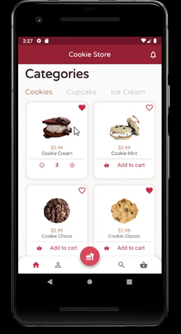
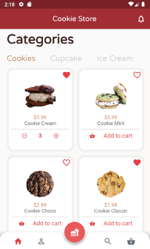
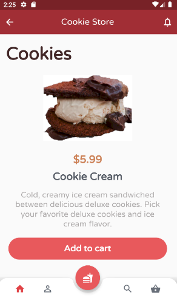
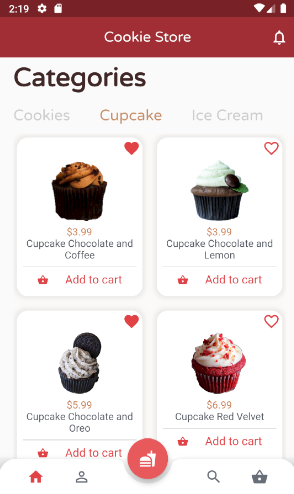
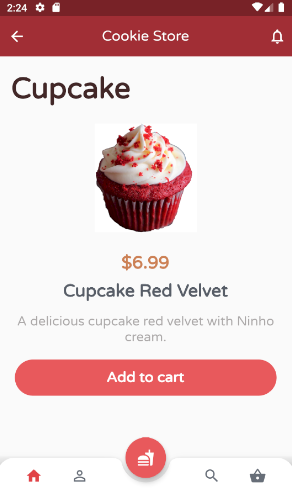
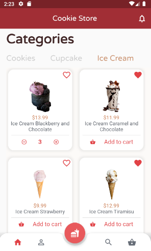
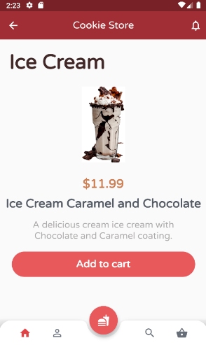

<h1 align="center">
 
  
 
 
Cookie Store
</h1>

📲 A cookie store app, showing categories screens. 📲

  

## Screenshot 📷

### Home Screen
<pre>
                                                
</pre>

-📌 **Category Cookie**
<pre>
                             
</pre>

-📌 **Category Cupcake**
<pre>
                             
</pre>

-📌 **Category Ice Cream**
<pre>
                             
</pre>

## Features 🗃️
This app features all the latest tools and practices in mobile development!

- **Flutter** 
- **Http Request**
- **Bottom App Bar** 
- **JSON**

## License 📃

This project is licensed under the MIT License - see the [LICENSE](https://opensource.org/licenses/MIT) page for details.
